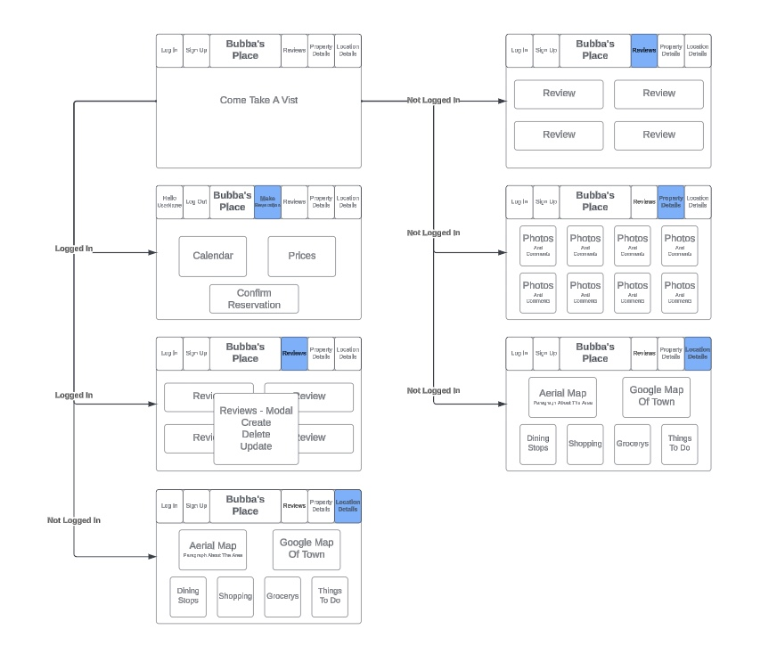

# Bubba's Place

### Come relax at Bubba's Place. Let this app make my home become your next vacation rental spot. Users will be able to view the property from the custom bathroom getaway, out to the hammock on the deck under the trees, view the refreshing solar heated pool with patio, or the walking trail through the trees to the Trinity River. Users can also view information about where this property is located in Willow Creek California and learn where to eat, shop, things to do section and a map of the town. Users can then create an account, login, and the look at the calendar and price of the vacation rental. Users can decide to book a reservation, ask a question, or leave a review.

## Link https://github.com/Tessabaxter12/Bubbas-Place.git

## Users Story
- View Home Page
- See Photos And Comments About Property
- Read About Location Of Willow Creek
- Sign Up / Login
- Users Can Make Resverations On Calendar
- Users Can Ask Questions.
- User Can Write A Review / That Can Be Update Or Delete
- Sign Out

## Wireframe

## Built With: 
- Node
- React
- HTML
- CSS
- JavaScript
- Bootstrap
- OAuth
- Moongoose

## ERD

## Icebox Features
- Calculate Cost For Stay / Collect Payment With Strip Integration
- Calculate Distance To Property From Users Location